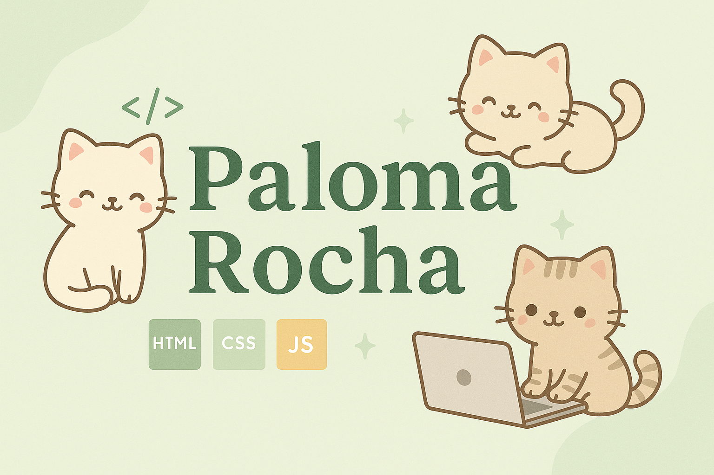

<h1 align="center">Olá, eu sou a Paloma 💚</h1>

Desenvolvedora Front-end | Apaixonada por interfaces bonitas e acessíveis | Criadora de soluções com HTML, CSS, JavaScript & React

  

---

## 🪴 Sobre mim

Desenvolvedora front-end com foco em criar experiências digitais modernas, acessíveis e bem estruturadas. Tenho 20 anos, curso Engenharia de Software na Unifran e atualmente estou no sexto período da graduação.

Amo transformar ideias em interfaces funcionais e responsivas, buscando sempre unir design com código de forma harmoniosa. Estou sempre explorando novas formas de entregar soluções criativas com HTML, CSS, JavaScript e React.

Trabalho com tecnologias como:
- 🌐 HTML5, CSS3, JavaScript.
- ⚛️ React.
- 🎨 Figma e Illustrator (para transformar interfaces em experiências reais)

Busco sempre aprender algo novo e me envolver com a comunidade tech.

---

## ✨ Projetos em destaque

- [Portfólio](https://palomarocha.github.io/palomarocha-Meu-Portifolio/) – Meu portfólio pessoal com alguns dos projetos que desenvolvi.
- [Vantaro](https://github.com/palomarocha/Vantaro)  – site voltado para cadastro e gerenciamento de carros
- [Glimmer](https://github.com/palomarocha/landing-page-makeup) – Projeto sobre uma landing page projetada para uma loja de maquiagem.

---

## 📫 Vamos nos conectar?

- 🌐 [palomarocha.github.io](https://palomarocha.github.io/palomarocha-Meu-Portifolio/)
- 💌 [palomarocha022@gmail.com](mailto:palomarocha022@gmail.com)
- 💼 [LinkedIn](https://linkedin.com/in/paloma-rocha-amaral-02239031a/)
- 📸 [Instagram](https://www.instagram.com/__blo.om__?igsh=cHk5dGdweHYxbmI5)

---

  

